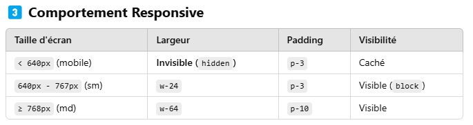

# React + Vite

This template provides a minimal setup to get React working in Vite with HMR and some ESLint rules.

Currently, two official plugins are available:

- [@vitejs/plugin-react](https://github.com/vitejs/vite-plugin-react/blob/main/packages/plugin-react/README.md) uses [Babel](https://babeljs.io/) for Fast Refresh
- [@vitejs/plugin-react-swc](https://github.com/vitejs/vite-plugin-react-swc) uses [SWC](https://swc.rs/) for Fast Refresh

Comportement Responsive

Taille d'écran Largeur Padding Visibilité

< 640px (mobile) Invisible (hidden) p-3 Caché
640px - 767px (sm) w-24 p-3 Visible(block)
≥ 768px (md) w-64 p-10 Visible

